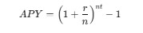

# Key Metrics for Solana Validators

##  Annual Percentage Yield (APY)
- **Definition**: APY represents the total amount of interest or rewards earned on staked assets over a year, expressed as a percentage. It factors in compounding effects, providing a more accurate picture of potential earnings.
- **Importance**: APY is crucial for delegators because it helps them compare different validators. A higher APY indicates potentially higher rewards, but it’s essential to consider the validator’s reliability and performance.
- **Calculation**: APY is calculated using the formula:

    

    Where:
- `r` is the interest rate
- `n` is the number of compounding periods per year
- `t` is the number of years

##  Commission Rate
- **Definition**: This is the fee that the validator takes from the rewards earned by delegators. It is typically expressed as a percentage.
- **Importance**: A lower commission rate means more rewards for delegators. However, it’s essential to balance commission rates with the validator's performance and reliability.
- **Typical Range**: In Solana, commission rates often range from 5% to 10%, though some validators may charge higher or lower rates.

## 3. Performance Metrics
- **Uptime**: 
  - **Definition**: This metric indicates the percentage of time the validator has been operational and validating transactions successfully. High uptime is crucial for reliability.
  - **Importance**: Validators with high uptime are more likely to earn rewards consistently and provide a better experience for delegators.
  - **Ideal Uptime**: An uptime of 99% or higher is generally considered acceptable in the Solana ecosystem.

- **Vote Account Activity**:
  - **Definition**: This metric shows how frequently the validator votes on blocks. High voting activity suggests the validator is engaged and operational.
  - **Importance**: Consistent voting activity reflects a validator's reliability and commitment to the network. It also impacts the validator's ability to earn rewards.

##  Total Delegated Stake
- **Definition**: This metric shows the total amount of SOL tokens delegated to a validator. It reflects the validator’s popularity and trustworthiness among delegators.
- **Importance**: A higher total delegated stake typically indicates a more reliable and efficient validator. It can also influence the validator’s APY, as a larger stake may lead to more consistent rewards.

##  Average Blocks Produced
- **Definition**: This metric tracks the average number of blocks produced by the validator over a specific period.
- **Importance**: Validators that produce more blocks contribute to the network's security and efficiency. A higher average blocks produced often correlates with higher rewards.

##  Penalties and Slashing
- **Definition**: Validators can incur penalties for being offline or failing to validate transactions correctly. This can lead to slashing, where a portion of the validator’s staked tokens is confiscated.
- **Importance**: Understanding a validator's history of penalties and slashing events is critical for delegators, as it affects the overall security and reliability of their investments.

##  Historical Performance Data
- **Definition**: This encompasses various metrics collected over time, including APY, uptime, and commission rates.
- **Importance**: Analyzing historical performance helps delegators make informed decisions about which validators to trust and invest in. It provides insights into consistency and reliability.

## Conclusion
When choosing a validator in the Solana ecosystem, it's essential to evaluate these metrics comprehensively. While APY is a significant factor in determining potential rewards, other metrics such as uptime, commission rates, and historical performance should also be considered to ensure a secure and profitable staking experience. Validators with high reliability, engagement, and transparency are more likely to foster trust and attract delegators.
